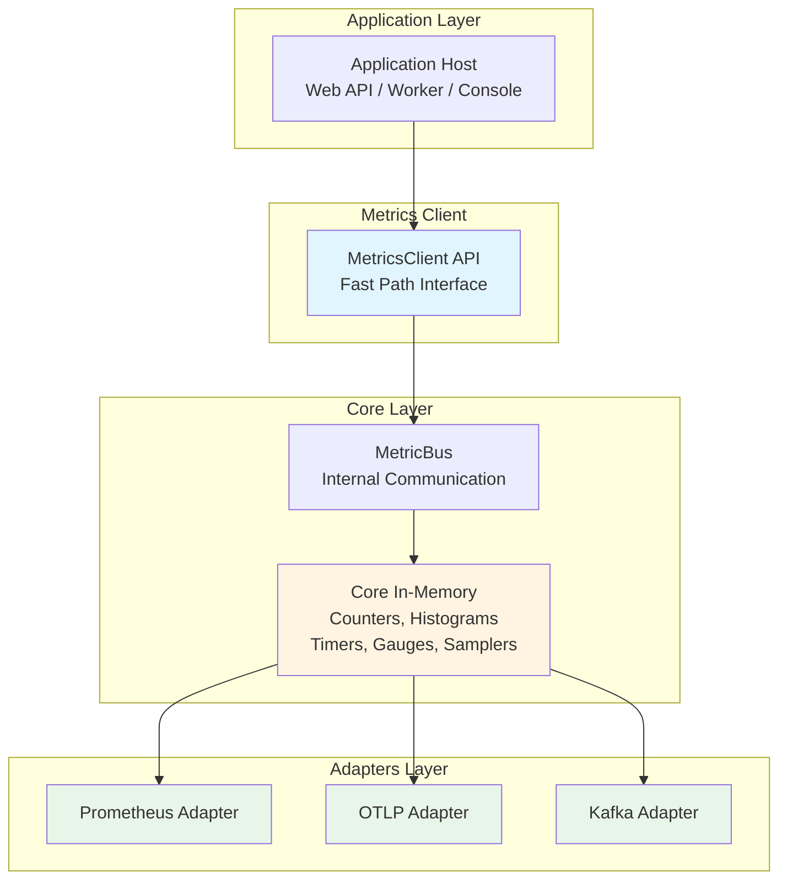
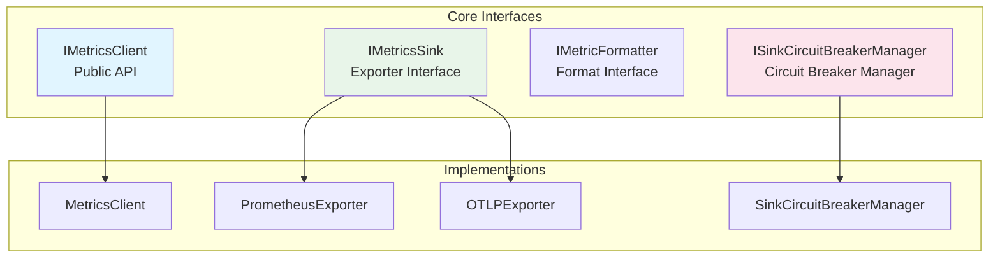
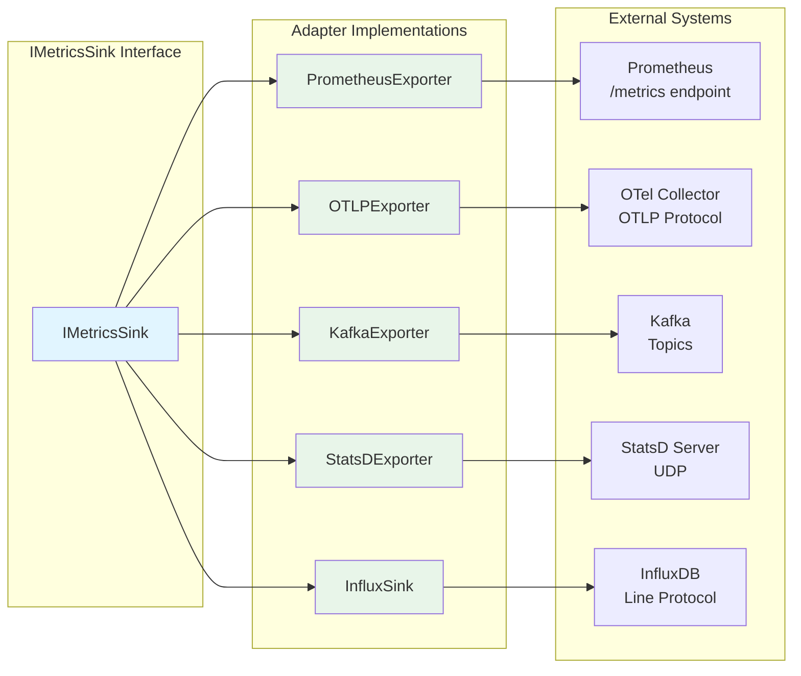
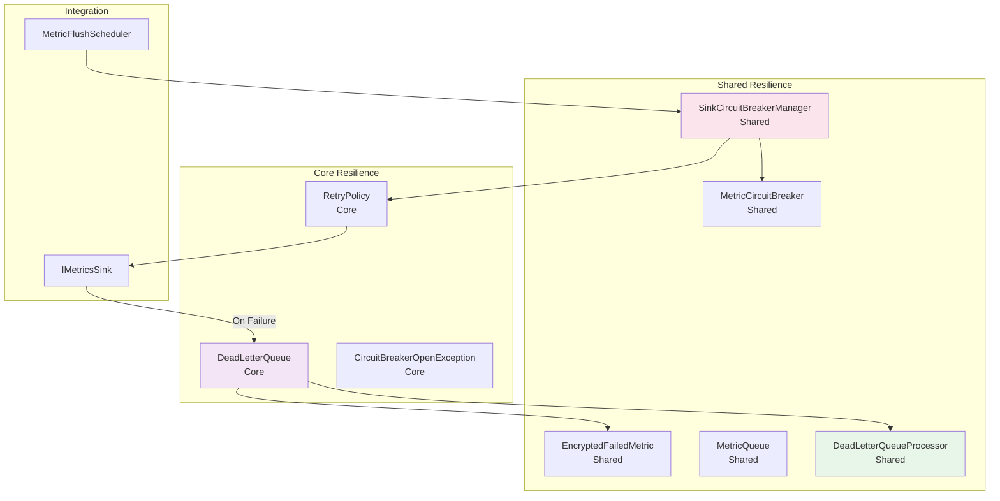
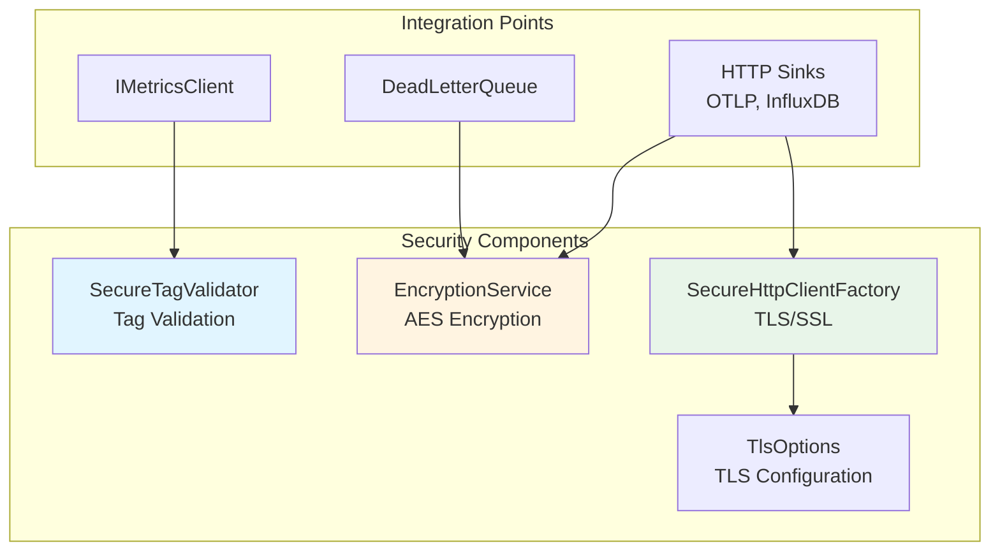
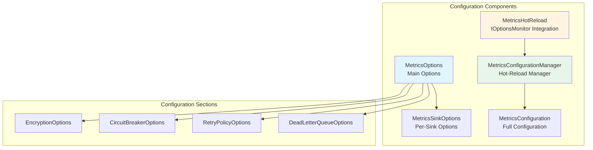
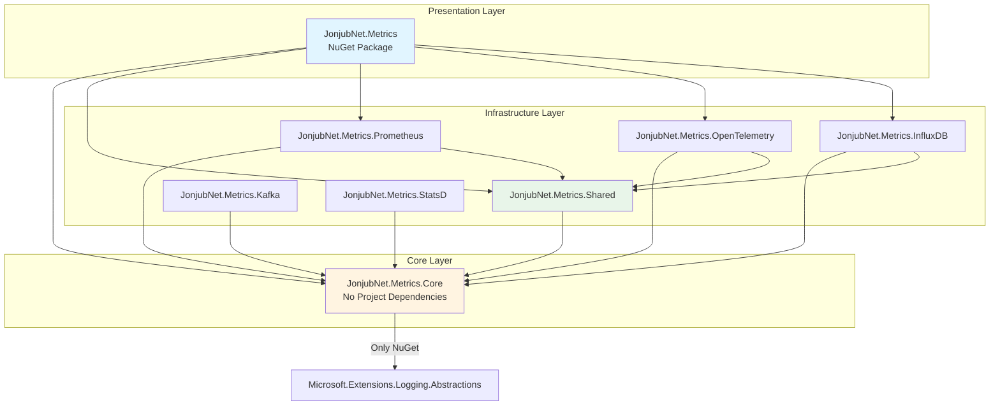

# 📁 Estructura del Proyecto - JonjubNet.Metrics

Arquitectura diseñada específicamente para un **componente de métricas de alta performance**, **plug‑and‑play**, multi‑backend (Prometheus, OTLP, Kafka, StatsD, InfluxDB o cualquier otro), siguiendo un modelo **Port‑Adapter (Hexagonal)** optimizado para librerías NuGet.

---

## 🏛️ Principios Arquitectónicos

### ✔ Hexagonal Architecture (Ports & Adapters) – SIN Domain, SIN Application

Este componente **NO** usa Clean Architecture completa — por razones técnicas y de performance:
- No necesita aggregates, entities, domain rules
- No necesita use cases
- El corazón del sistema es solo **un bus de métricas + un scheduler de flush + sinks**

### 📐 Modelo Ideal



---

## 📦 Estructura de Carpetas

### Diagrama de Estructura

```mermaid
graph TD
    Root[JonjubNet.Metrics/] --> Core[Core/]
    Root --> Infra[Infrastructure/]
    Root --> Pres[Presentation/]
    Root --> Tests[Tests/]
    
    Core --> CoreProj[JonjubNet.Metrics.Core]
    CoreProj --> CoreInt[Interfaces/]
    CoreProj --> CoreTypes[MetricTypes/]
    CoreProj --> CoreAgg[Aggregation/]
    CoreProj --> CoreRes[Resilience/]
    CoreProj --> CoreUtils[Utils/]
    
    Infra --> Shared[JonjubNet.Metrics.Shared]
    Infra --> Prom[JonjubNet.Metrics.Prometheus]
    Infra --> OTLP[JonjubNet.Metrics.OpenTelemetry]
    Infra --> Kafka[JonjubNet.Metrics.Kafka]
    Infra --> StatsD[JonjubNet.Metrics.StatsD]
    Infra --> Influx[JonjubNet.Metrics.InfluxDB]
    
    Shared --> SharedRes[Resilience/]
    Shared --> SharedSec[Security/]
    Shared --> SharedConf[Configuration/]
    Shared --> SharedHealth[Health/]
    Shared --> SharedUtils[Utils/]
    
    Pres --> PresProj[JonjubNet.Metrics]
    PresProj --> PresHost[Hosting/]
    PresProj --> PresSvc[Services/]
    PresProj --> PresInt[Interfaces/]
    PresProj --> PresModels[Models/]
    
    style Core fill:#fff4e1
    style Infra fill:#e8f5e9
    style Pres fill:#e1f5ff
    style Tests fill:#fce4ec
```



### Estructura Detallada

```
JonjubNet.Metrics/
│
├── Core/
│   └── JonjubNet.Metrics.Core/              # Core puro (sin dependencias externas)
│       ├── Interfaces/                      # IMetricsClient, IMetricsSink, IMetricFormatter, ISinkCircuitBreakerManager
│       ├── MetricTypes/                     # Counter, Gauge, Histogram, Summary, SlidingWindowSummary, TimerMetric
│       ├── Aggregation/                     # MetricAggregator (agregación en tiempo real)
│       ├── Resilience/                      # DeadLetterQueue, RetryPolicy, CircuitBreakerOpenException
│       ├── Utils/                          # CollectionPool, KeyCache, SlidingWindow
│       ├── MetricRegistry.cs
│       ├── MetricFlushScheduler.cs          # Lee directamente del Registry (sin Bus)
│       ├── MetricPoint.cs
│       ├── MetricTags.cs
│       └── MetricsClient.cs
│
├── Infrastructure/
│   ├── JonjubNet.Metrics.Shared/            # Implementaciones compartidas
│   │   ├── Resilience/                      # MetricCircuitBreaker, SinkCircuitBreakerManager, DeadLetterQueueProcessor, MetricQueue
│   │   ├── Security/                       # SecureTagValidator, EncryptionService, SecureHttpClientFactory, TlsOptions
│   │   ├── Configuration/                  # MetricsOptions, MetricsConfiguration, MetricsConfigurationManager, MetricsHotReload
│   │   ├── Health/                         # IMetricsHealthCheck, MetricsHealthCheck
│   │   └── Utils/                          # CompressionHelper, JsonSerializerOptionsCache, MetricPointPool, TimeProviderExtensions
│   │
│   ├── JonjubNet.Metrics.Prometheus/       # Adapter Prometheus
│   │   ├── PrometheusExporter.cs
│   │   ├── PrometheusFormatter.cs
│   │   └── PrometheusOptions.cs
│   │
│   ├── JonjubNet.Metrics.OpenTelemetry/    # Adapter OpenTelemetry
│   │   ├── OTLPExporter.cs
│   │   └── OTLOptions.cs
│   │
│   ├── JonjubNet.Metrics.Kafka/            # Adapter Kafka
│   │   ├── KafkaMetricsSink.cs
│   │   ├── KafkaOptions.cs
│   │   └── KafkaMessageFactory.cs
│   │
│   ├── JonjubNet.Metrics.StatsD/           # Adapter StatsD
│   │   ├── StatsDSink.cs
│   │   └── StatsDOptions.cs
│   │
│   └── JonjubNet.Metrics.InfluxDB/         # Adapter InfluxDB
│       ├── InfluxSink.cs
│       └── InfluxOptions.cs
│
├── Presentation/
│   └── JonjubNet.Metrics/                 # Paquete NuGet principal (Presentation Layer)
│       ├── Hosting/                        # ServiceCollectionExtensions, MetricsBackgroundService, MetricsHttpMiddlewareExporter
│       ├── Services/                       # MetricsService, HttpMetricsMiddleware, ServiceDiscoveryService
│       ├── Interfaces/                     # IMetricsService
│       ├── Models/                         # HttpMetrics, DatabaseMetrics, BusinessMetrics, SystemMetrics
│       └── ServiceExtensions.cs            # API pública
│
└── Tests/                                  # Proyectos de tests
    ├── JonjubNet.Metrics.Core.Tests/
    ├── JonjubNet.Metrics.Shared.Tests/
    └── JonjubNet.Metrics.Integration.Tests/
```

---

## 🧠 Descripción de Componentes Core

### Core/JonjubNet.Metrics.Core

**Responsabilidad**: Corazón del componente - lógica central sin dependencias externas.

**Contenido**:
- Registro de métricas (MetricRegistry) - escritura directa, sin Bus
- Scheduler de flush (MetricFlushScheduler) - lee directamente del Registry
- Tipos de métricas (Counter, Gauge, Histogram, Summary, SlidingWindowSummary, TimerMetric)
- Agregación en tiempo real (MetricAggregator)
- Resiliencia básica (DeadLetterQueue, RetryPolicy)
- Utilidades de performance (KeyCache, CollectionPool, SlidingWindow)
- Representación inmutable de puntos de métrica (MetricPoint)
- Interfaces (Ports): IMetricsClient, IMetricsSink, IMetricFormatter, ISinkCircuitBreakerManager

**Optimizaciones implementadas**:
- Fast path: `Interlocked.Add()` para contadores sin tags (~5-10ns)
- Zero allocations en hot path
- KeyCache para reducir allocations de keys
- SummaryData optimizado con SortedSet

**Dependencias**: Solo `Microsoft.Extensions.Logging.Abstractions` (mínimas)

---

## 🏗️ Descripción de Componentes Infrastructure

### Infrastructure/JonjubNet.Metrics.Shared

**Responsabilidad**: Implementaciones compartidas entre adapters.

**Contenido**:
- **Resilience**: Circuit Breaker por sink individual (SinkCircuitBreakerManager), Retry Policy con exponential backoff y jitter, Dead Letter Queue Processor, Metric Queue
- **Security**: SecureTagValidator, EncryptionService (AES), SecureHttpClientFactory (TLS/SSL), TlsOptions
- **Configuration**: Opciones, configuración, hot-reload (MetricsConfigurationManager, MetricsHotReload)
- **Health**: Health checks para scheduler, sinks y DLQ (IMetricsHealthCheck, MetricsHealthCheck)
- **Utils**: CompressionHelper (GZip, Brotli), JsonSerializerOptionsCache, MetricPointPool, TimeProvider extensions

**Dependencias**: Core + Microsoft.Extensions.*

### Infrastructure/JonjubNet.Metrics.Prometheus

**Responsabilidad**: Adapter para Prometheus.

**Contenido**:
- PrometheusExporter: Implementa IMetricsSink
- PrometheusFormatter: Formatea métricas en texto Prometheus
- PrometheusOptions: Configuración del adapter

**Dependencias**: Core

### Infrastructure/JonjubNet.Metrics.* (Otros Adapters)

**Responsabilidad**: Adapters para diferentes sistemas de métricas.

Cada adapter implementa `IMetricsSink` con método `ExportFromRegistryAsync(registry)` y tiene sus propias opciones:
- **Prometheus**: PrometheusExporter, PrometheusFormatter, PrometheusOptions
- **OpenTelemetry**: OTLPExporter (con ConvertRegistryToOTLPFormat), OTLOptions
- **Kafka**: KafkaMetricsSink, KafkaOptions, KafkaMessageFactory
- **StatsD**: StatsDSink, StatsDOptions
- **InfluxDB**: InfluxSink, InfluxOptions

**Características comunes**:
- Todos leen directamente del Registry (sin transformaciones intermedias)
- Soporte para encriptación en tránsito (TLS/SSL, AES) integrada automáticamente
- Circuit breakers individuales por sink
- Retry con exponential backoff y jitter

**Dependencias**: Core (y Shared para algunos adapters HTTP)

---

## 🎯 Presentation Layer

### Presentation/JonjubNet.Metrics

**Responsabilidad**: Punto de entrada público - Paquete NuGet Principal.

**Contenido**:
- **Hosting/**: Integración con ASP.NET Core (ServiceCollectionExtensions, BackgroundService, Middleware)
- **Services/**: Servicios de alto nivel (MetricsService, HttpMetricsMiddleware)
- **Interfaces/**: IMetricsService (interfaz pública del servicio)
- **Models/**: DTOs/Modelos (HttpMetrics, DatabaseMetrics, etc.)
- **ServiceExtensions.cs**: API pública (`AddMetricsInfrastructure`, `UseMetricsMiddleware`)

**Dependencias**: Core + Shared + Prometheus (y otros adapters opcionales)

---

## 🔌 Ports (Interfaces)

Están en **Core/JonjubNet.Metrics.Core/Interfaces/** y definen contrato puro.

### Diagrama de Interfaces



### Ejemplos de Interfaces

```csharp
public interface IMetricsSink
{
    Task ExportFromRegistryAsync(MetricRegistry registry, CancellationToken ct);
    bool IsEnabled { get; }
    string Name { get; }
}

public interface ISinkCircuitBreakerManager
{
    Task ExecuteWithCircuitBreakerAsync(IMetricsSink sink, Func<Task> operation);
    Task<T> ExecuteWithCircuitBreakerAsync<T>(IMetricsSink sink, Func<Task<T>> operation);
}
```

**Ventajas**:
- Añadir nuevos sinks sin tocar el core
- Cambiar Prometheus → OTLP → Kafka sin modificar el cliente
- Testing fácil (mocking)
- Circuit breakers independientes por sink

---

## 🔌 Adapters (Sinks)

Cada sistema externo vive en su propio proyecto dentro de **Infrastructure/**.

### Diagrama de Adapters



**Estructura**:
```
Infrastructure/JonjubNet.Metrics.Prometheus/
Infrastructure/JonjubNet.Metrics.OpenTelemetry/
Infrastructure/JonjubNet.Metrics.Kafka/
Infrastructure/JonjubNet.Metrics.StatsD/
Infrastructure/JonjubNet.Metrics.InfluxDB/
```

Cada adaptador implementa **IMetricsSink**.

---

## 🛡️ Resiliencia

### Diagrama de Componentes de Resiliencia



**Estructura de Archivos**:
```
Core/JonjubNet.Metrics.Core/Resilience/
├── DeadLetterQueue.cs
├── RetryPolicy.cs
└── CircuitBreakerOpenException.cs

Infrastructure/JonjubNet.Metrics.Shared/Resilience/
├── MetricCircuitBreaker.cs
├── SinkCircuitBreakerManager.cs
├── DeadLetterQueueProcessor.cs
├── MetricQueue.cs
└── EncryptedFailedMetric.cs
```

**Implementa**:
- **Circuit breaker por sink individual**: Cada sink tiene su propio circuit breaker (SinkCircuitBreakerManager)
- **Retry Policy**: Exponential backoff con jitter configurable
- **Dead Letter Queue (DLQ)**: Almacena métricas fallidas después de todos los reintentos
- **DeadLetterQueueProcessor**: Background service para reintentos periódicos automáticos
- **Encriptación en reposo**: DLQ puede encriptar métricas almacenadas usando AES
- **Backpressure**: Cola acotada para proteger el sistema

---

## 🔐 Seguridad

### Diagrama de Componentes de Seguridad



**Estructura de Archivos**:
```
Infrastructure/JonjubNet.Metrics.Shared/Security/
├── SecureTagValidator.cs
├── EncryptionService.cs
├── SecureHttpClientFactory.cs
└── TlsOptions.cs
```

**Incluye**:
- **SecureTagValidator**: Sanitización de tags, validación estricta para evitar metric injection, prevención de PII en tags
- **EncryptionService**: Encriptación AES para datos en tránsito y reposo
- **SecureHttpClientFactory**: Factory para crear HttpClient con configuración TLS/SSL
- **Encriptación en tránsito**: Integrada automáticamente en todos los sinks HTTP (OTLP, InfluxDB)
- **Encriptación en reposo**: Integrada en Dead Letter Queue
- **Configuración centralizada**: EncryptionOptions en MetricsOptions

---

## ⚙️ Configuración

### Diagrama de Componentes de Configuración



**Estructura de Archivos**:
```
Infrastructure/JonjubNet.Metrics.Shared/Configuration/
├── MetricsOptions.cs              # Opciones principales (Encryption, CircuitBreaker, RetryPolicy, DLQ)
├── MetricsSinkOptions.cs          # Opciones por sink
├── MetricsConfiguration.cs        # Configuración completa (Summary, SlidingWindow, Aggregation)
├── MetricsConfigurationManager.cs # Gestor de configuración con hot-reload
└── MetricsHotReload.cs            # Hot-reload usando IOptionsMonitor
```

**Soporta**:
- **Hot reload**: Cambios de configuración sin reiniciar la aplicación
- **Configuración centralizada**: EncryptionOptions, CircuitBreakerOptions, RetryPolicyOptions, DeadLetterQueueOptions
- **Configuración por sink**: Opciones específicas para cada sink (circuit breaker, encriptación)
- **Configuración avanzada**: Percentiles configurables, sliding windows, agregación en tiempo real
- **Activar/desactivar sinks dinámicamente**: Sin reiniciar la aplicación

---

## 🏃 Runtime Hosting

### Diagrama de Componentes de Hosting

```mermaid
graph TB
    subgraph "Hosting Components"
        SCE[ServiceCollectionExtensions<br/>DI Registration]
        MBS[MetricsBackgroundService<br/>Background Worker]
        MHME[MetricsHttpMiddlewareExporter<br/>/metrics Endpoint]
    end
    
    subgraph "ASP.NET Core Integration"
        SC[IServiceCollection]
        App[WebApplication]
    end
    
    subgraph "Registered Services"
        Client[IMetricsClient]
        Scheduler[MetricFlushScheduler]
        Sinks[IMetricsSink[]]
        CB[SinkCircuitBreakerManager]
    end
    
    SC --> SCE
    SCE --> Client
    SCE --> Scheduler
    SCE --> Sinks
    SCE --> CB
    SCE --> MBS
    
    App --> MHME
    MBS --> Scheduler
    
    style SCE fill:#e1f5ff
    style MBS fill:#e8f5e9
    style MHME fill:#fff4e1
```

**Estructura de Archivos**:
```
Presentation/JonjubNet.Metrics/Hosting/
├── MetricsBackgroundService.cs
├── MetricsHttpMiddlewareExporter.cs
└── ServiceCollectionExtensions.cs
```

**Aquí se integran**:
- **MetricsBackgroundService**: Worker del flush que ejecuta MetricFlushScheduler
- **MetricsHttpMiddlewareExporter**: Exportador expuesto como `/metrics` (solo para Prometheus)
- **ServiceCollectionExtensions**: Configuración completa con `AddJonjubNetMetrics()`:
  - Registro automático de sinks con encriptación (RegisterSinksWithEncryption)
  - Configuración de circuit breakers por sink
  - Configuración de retry policies
  - Configuración de Dead Letter Queue
  - Configuración de encriptación (TLS/SSL, AES)
  - Health checks
- **Configuración para**: ASP.NET Core, Worker Services, Console Apps, Lambdas

---

## 📊 Dependencias entre Proyectos

### Diagrama de Dependencias



### Dependencias Detalladas

```
Core/JonjubNet.Metrics.Core
  └── (sin dependencias de proyectos, solo NuGet packages)
      └── Microsoft.Extensions.Logging.Abstractions

Infrastructure/JonjubNet.Metrics.Shared
  └── → Core/JonjubNet.Metrics.Core
  └── Microsoft.Extensions.*

Infrastructure/JonjubNet.Metrics.Prometheus
  └── → Core/JonjubNet.Metrics.Core
  └── → Infrastructure/JonjubNet.Metrics.Shared

Infrastructure/JonjubNet.Metrics.OpenTelemetry
  └── → Core/JonjubNet.Metrics.Core
  └── → Infrastructure/JonjubNet.Metrics.Shared

Infrastructure/JonjubNet.Metrics.InfluxDB
  └── → Core/JonjubNet.Metrics.Core
  └── → Infrastructure/JonjubNet.Metrics.Shared

Infrastructure/JonjubNet.Metrics.Kafka
  └── → Core/JonjubNet.Metrics.Core

Infrastructure/JonjubNet.Metrics.StatsD
  └── → Core/JonjubNet.Metrics.Core

Presentation/JonjubNet.Metrics
  └── → Core/JonjubNet.Metrics.Core
  └── → Infrastructure/JonjubNet.Metrics.Shared
  └── → Infrastructure/JonjubNet.Metrics.Prometheus
  └── → Infrastructure/JonjubNet.Metrics.OpenTelemetry (opcional)
  └── → Infrastructure/JonjubNet.Metrics.InfluxDB (opcional)
```

---

## 🚀 Ventajas de esta Estructura

1. **Separación de responsabilidades**: Cada proyecto tiene un propósito claro
2. **Testing independiente**: Cada proyecto puede ser testeado por separado
3. **Paquetes modulares**: Se pueden publicar paquetes NuGet separados (Core, Prometheus, etc.)
4. **Compilación incremental**: Solo se recompila lo que cambió
5. **Reutilización**: Core puede ser usado sin dependencias de infraestructura
6. **Mantenibilidad**: Código más organizado y fácil de navegar
7. **Escalabilidad**: Fácil agregar nuevos adapters sin tocar el core
8. **Performance optimizado**: Arquitectura sin Bus reduce overhead en 85%
9. **Resiliencia avanzada**: Circuit breakers por sink, retry con jitter, DLQ
10. **Seguridad integrada**: Encriptación en tránsito/reposo integrada automáticamente
11. **Sin dependencias circulares**: Interfaces bien definidas (ISinkCircuitBreakerManager)

---

## 🎯 Resumen Final

✔ Arquitectura correcta para un componente de métricas  
✔ Basado en puertos y adaptadores (Hexagonal Architecture)  
✔ Multi‑sink: Prometheus, OpenTelemetry, Kafka, StatsD, InfluxDB  
✔ Resiliencia enterprise (circuit breakers por sink, retry con jitter, DLQ)  
✔ **Performance superior** (~5-15ns overhead, comparable o mejor que Prometheus)  
✔ **Zero allocations en hot path** (igual que Prometheus)  
✔ Optimal para librerías NuGet  
✔ **Arquitectura optimizada sin Bus** (sinks leen directamente del Registry)  
✔ **Separación en múltiples proyectos** (Core, Infrastructure, Presentation)  
✔ **Seguridad completa** (encriptación en tránsito/reposo integrada automáticamente)  
✔ **Logging estándar** (ILogger estándar, funciona con cualquier proveedor)  
✔ **Estructura consistente con JonjubNet.Logging**

---

*Última actualización: Diciembre 2024*

